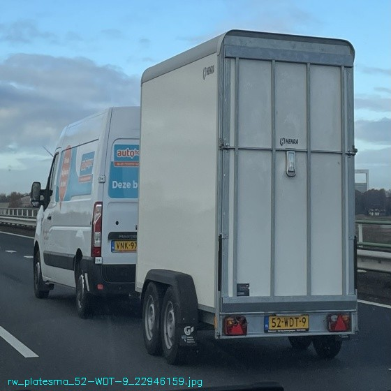
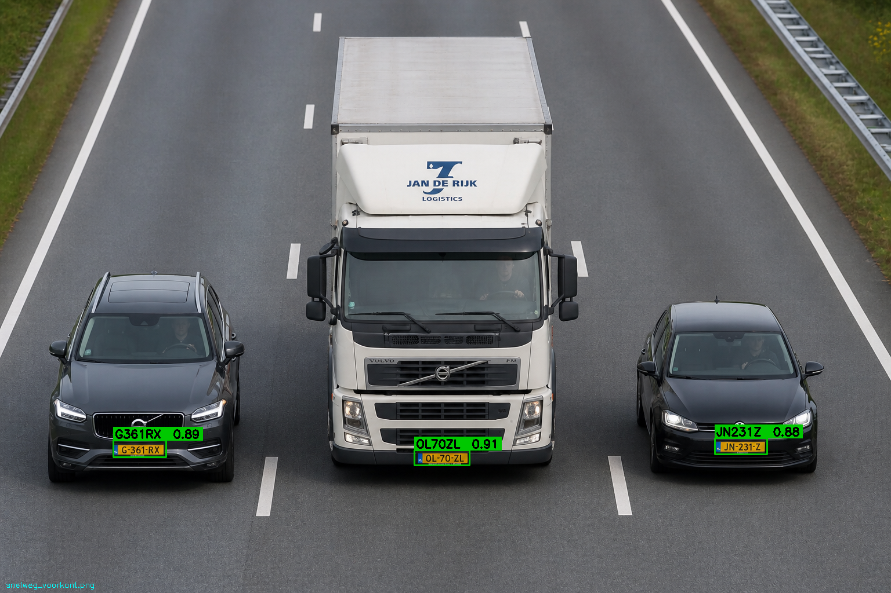
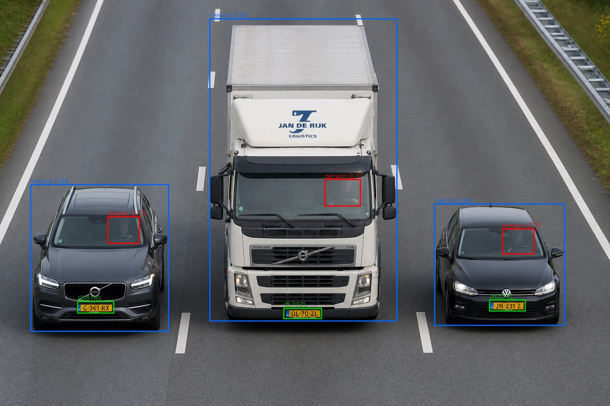
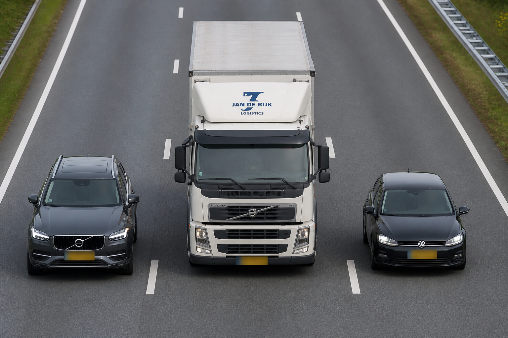

# Dutch License Plate Detector

Two scripts for Dutch license plate detection, OCR and privacy blurring.  
Models download automatically from HuggingFace and Ultralytics on first run — no manual setup needed.

## Install

```bash
pip install -r requirements.txt
```

---

## `detect.py` — Plate detection + OCR

Finds and reads license plates in images.

```bash
# Single image
python detect.py --images photo.jpg

# Folder of images
python detect.py --images ./photos

# Custom output folder and confidence threshold
python detect.py --images ./photos --output ./results --confidence 0.4

# JSON only, no annotated images
python detect.py --images ./photos --no-visualize

# Use a local ONNX model (skip HF download)
python detect.py --images ./photos --model ./inference_model.onnx
```

### Example output

| Single plate | Multi-vehicle |
|---|---|
|  |  |

### JSON output

Annotated images and a `results.json` are saved to `./output/` (or `--output`).

```json
[
  {
    "file": "photo.jpg",
    "detections": [
      { "bbox": [120, 340, 180, 42], "confidence": 0.92, "plate": "52WDT9" }
    ]
  }
]
```

Terminal:

```
Processing 3 image(s)...

  +  photo1.jpg: 52WDT9
  +  photo2.jpg: JKB18V, 33STXH
  -  photo3.jpg: no plates found

---------------------------------------------
Processed : 3 images in 4.1s
With plate: 2  (67%)
Avg speed : 1367 ms/image
```

---

## `blur.py` — Privacy blurring

Detects persons, vehicles and license plates. Blurs all persons and plates by default.  
Optionally exempt the driver of a specific vehicle from blurring.

```bash
# Blur all persons and plates (YOLO, default)
python blur.py --images ./photos

# Use RF-DETR for better person/vehicle detection (recommended)
python blur.py --images ./photos --detector rfdetr

# Exempt the driver of a specific plate from blurring
python blur.py --images ./photos --detector rfdetr --exempt-plate OL70ZL

# Single image with exempt plate
python blur.py --images photo.jpg --output ./blurred --exempt-plate JKB18V

# RF-DETR Large (more accurate, slower)
python blur.py --images ./photos --detector rfdetr --rfdetr-large

# Adjust confidence thresholds
python blur.py --images ./photos --confidence-person 0.5 --confidence-plate 0.4

# Debug mode: shows detection boxes and saves debug images
python blur.py --images ./photos --debug

# Windshield fallback for aerial/overhead shots without visible faces
python blur.py --images ./photos --windshield-fallback

# Use a local plate ONNX model (skip HF download)
python blur.py --images ./photos --plate-model ./inference_model.onnx
```

### Example output

**Original:**


**Detections (debug view — vehicles in blue, persons in red, plates in green):**



**Result — all persons and plates blurred:**



### Detector options

| Flag | Model | Speed | Accuracy |
|---|---|---|---|
| *(default)* | YOLO11n | Fast | Good |
| `--detector rfdetr` | RF-DETR Base (COCO) | Slower | Higher |
| `--detector rfdetr --rfdetr-large` | RF-DETR Large (COCO) | Slowest | Best |

RF-DETR is recommended when persons are partially visible or photographed from an angle.

### JSON output

Blurred images and a `blur_results.json` are saved to `./blurred/` (or `--output`).

```json
[
  {
    "file": "photo.jpg",
    "persons_detected": 3,
    "persons_blurred": 3,
    "vehicles_detected": 3,
    "plates_found": ["OL70ZL", "G361RX", "JN231Z"],
    "plates_blurred": 3,
    "exempt_plate": null,
    "exempt_vehicle_found": false
  }
]
```

---

## How it works

### Plate detection (`detect.py` + `blur.py`)
1. **RF-DETR Base** (ONNX, 560×560) — finds plate bounding boxes
2. **Geometry filter** — rejects boxes with wrong aspect ratio (< 1.5 or > 9.0) or too large (> 15% of image)
3. **fast-plate-ocr** (`european-plates-mobile-vit-v2-model`) — reads plate text
4. **Format validation** — regex check against all Dutch sidecodes (1–14), agricultural, diplomatic and moped formats

### Privacy blurring (`blur.py`)
1. **Person/vehicle detection** — YOLO11n or RF-DETR (COCO 80 classes)
2. **Face fallback** — OpenCV DNN SSD ResNet10 runs multiscale on each vehicle crop and the full image to catch persons the main detector missed
3. **Plate association** — each detected plate is linked to the vehicle bbox it overlaps most
4. **Exempt logic** — if `--exempt-plate` is set, persons overlapping the matched vehicle are not blurred
5. **Plate blurring** — all detected plate bboxes are blurred; only the exempt plate is skipped
6. **Gaussian blur** — applied to all non-exempt persons and plates

---

## Model

Plate detector hosted on HuggingFace: [Rickkosse/rfdetr_licences_plate_detector](https://huggingface.co/Rickkosse/rfdetr_licences_plate_detector)

- Architecture: RF-DETR Base, 1 class (`license_plate`)
- Resolution: 560×560
- Training: synthetic plates on BDD100K + real-world crops
- EMA checkpoint, cosine LR schedule
